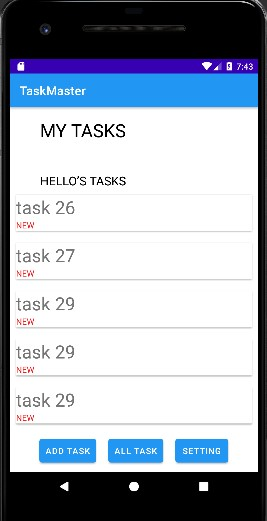
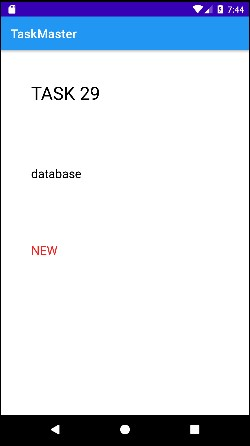
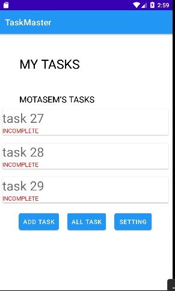
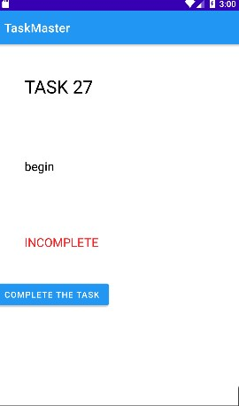
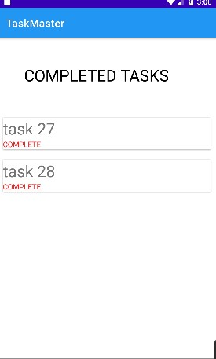

# taskmaster

## Overview
This is an application used to mange the tasks.

____________
### Lab 26

#### Feature Tasks

##### Homepage
The main page should have a heading at the top of the page, an image to mock the “my tasks” view,
and buttons at the bottom of the page to allow going to the “add tasks” and “all tasks” page.

_________

### Lab 27

#### Task Detail Page
Create a Task Detail page. It should have a title at the top of the page, and a Lorem Ipsum description.

____________

### Lab 28

#### Home Page

Refactor your homepage to use a RecyclerView for displaying Task data. This should have hardcoded Task data for now.
 you can tap on any one of the Tasks in the RecyclerView, and it will appropriately launch the detail page with the correct Task 
 title displayed.

#### Task Model

Create a Task class. A Task should have a title, a body, and a state. The state should be one of “new”, “assigned”, “in progress”, or “complete”

___________

### Lab 29

#### Add Task Form

Modify your Add Task form to save the data entered in as a Task in your local database.

#### Homepage
Refactor your homepage’s RecyclerView to display all Task entities in your database.

__________

### Lab 31

#### Espresso Testing

Add more Espresso UI tests to your application

#### Polish
Complete / fix up / polish any remaining feature tasks from previous days’ labs.

________

